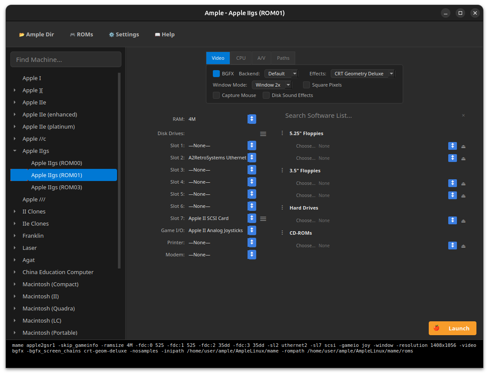

# AmpleLinux - Linux Port (Legacy Apple Emulator Frontend)

[English](README.md) | [繁體中文](README_tw.md)

這是一個將 macOS 原生 [Ample](https://github.com/ksherlock/ample) 專案移植至 Linux 平台的版本，基於 [AmpleWin](../AmpleWin/) Windows 移植版改編。



> [!IMPORTANT]
> **版本支援說明**：目前已同步支援至 Ample (macOS) **v0.285** 資源定義以及 **MAME 0.285** 核心。

## 🍎 Ample (macOS) vs. AmpleLinux (Linux) 完整對照表

| 功能項目 | Ample (macOS 原生版) | AmpleLinux (Linux 版) | 說明 |
| :--- | :--- | :--- | :--- |
| **程式語言** | Objective-C (Cocoa) | **Python 3.11 + PySide6 (Qt)** | 獨立開發，**完全沒動到 Mac 版原始碼** |
| **安裝方式** | .dmg 映像檔 / Homebrew | **免安裝綠色版 (+ .sh 自動配置)** | 透過 `AmpleLinux.sh` 一鍵搞定 Python 與依賴 |
| **MAME 整合** | 內建客製版核心 | **使用系統安裝的 MAME** | 透過 apt、dnf、pacman 等套件管理器安裝 |
| **UI 介面** | macOS 原生組件 | **1:1 像素級 QSS 複刻** | 支援 **Adaptive 自適應淺色/深色主題** (GNOME/KDE) |
| **初始機器選擇** | 支援預設書籤 | **全自動持久化 (自動載入上次狀態)** | 全自動開啟上次使用的機器 |
| **軟體清單效能** | 同步加載 | **延遲遞增加載 (Deferred Loading)** | 切換機器秒開 |
| **ROM 下載** | 支援自動下載 | **高效能 Failover 引擎** | 支援多伺服器切換 (callapple + mdk.cab) |
| **Video 支援** | Metal / OpenGL / BGFX | **BGFX / OpenGL / Vulkan** | 使用 MAME 的跨平台渲染後端 |

## 🌟 核心功能

### 🍏 忠實還原 Mac 體驗 (功能對齊)
*   **視覺精準度**：精準支援 **Window 1x-4x** 模式，並內建機器專屬的比例啟發邏輯。
*   **軟體資料庫**：智慧過濾、搜尋遮罩、相容性檢查。
*   **進階槽位模擬**：完整支援嵌套子槽位（如 SCSI 卡）。
*   **ROM 管理**：即時搜尋、多伺服器 Failover 下載、擴展韌體庫。
*   **共享目錄**：與 Mac 版功能完全對齊 (`-share_directory`)。

### 🐧 Linux 專屬功能
*   **系統 MAME 整合**：自動偵測 `PATH`、`/usr/bin/mame`、`/usr/games/mame` 等路徑。
*   **自適應主題**：即時偵測 GNOME (`gsettings`) 與 KDE 的深色/淺色模式。
*   **原生檔案管理**：使用 `xdg-open` 開啟檔案、資料夾和 URL。
*   **無額外依賴**：MAME 直接透過發行版的套件管理器安裝。

### ⚠️ 已知限制
*   **VGM Mod**：「Generate VGM」功能目前在 Linux 暫停使用，因為 MAME VGM Mod 功能所需的執行檔目前僅有 Windows 版本。


## 🛠️ 快速開始

### 前置需求
-   **Python 3.9+**
-   **MAME**（透過套件管理器安裝）
-   **PySide6** 和 **requests**（透過系統套件或 pip 安裝）

### 安裝步驟

1.  **安裝系統依賴套件**：
    *   **MAME**：透過您的套件管理器安裝（例如 `sudo apt install mame`）。
    *   **Python 3**：確認已安裝 Python 3.9+（`sudo apt install python3-full`）。
    *   **X11 支援**：GUI 介面所需（`sudo apt install libxcb-cursor0`）。

2.  **啟動 Ample**：
    ```bash
    cd AmpleLinux
    chmod +x AmpleLinux.sh
    ./AmpleLinux.sh
    ```
    腳本會**自動**建立虛擬環境 (`.venv`)，透過 pip 安裝 `PySide6` 與其他依賴套件，最後啟動程式。**您不需要手動執行 pip install。**

3.  **快速部署**：
    *   **Ubuntu 使用者**：如果找不到 MAME，程式會詢問是否透過 `snap` 安裝。
    *   點擊主介面的 **🎮 ROMs** 以補齊系統韌體。
    *   前往 **⚙️ Settings** 確認 MAME 已偵測到。
    *   選擇機器，然後 **Launch MAME**！

## 📦 封裝發佈 (Build for Release)

若要產生不需要依賴環境的獨立 Linux 執行檔 (ELF)：

```bash
cd AmpleLinux
chmod +x build_elf.sh
./build_elf.sh
```

此腳本會在暫存的 venv 中使用 `PyInstaller` 進行打包，產出的可攜式執行檔位於 `dist/AmpleLinux/`。

## 📂 專案結構

| 檔案/目錄 | 說明 |
| :--- | :--- |
| **`AmpleLinux.sh`** | **由此開始**。自動設定腳本 (使用 venv + pip)。 |
| **`build_elf.sh`** | **封裝腳本**。透過 PyInstaller 產生獨立執行檔。 |
| `make_icon.py` | 用於從來源圖片產生 Linux PNG 圖示的工具。 |
| `main.py` | 應用程式入口，處理 UI 渲染與主要邏輯。 |
| `data_manager.py` | 負責解析 `.plist` 機器定義檔與 MAME `.xml` 軟體列表。 |
| `mame_launcher.py` | MAME 指令建構器與執行序管理器。 |
| `rom_manager.py` | 系統 ROM 的管理與多執行緒下載引擎。 |
| `mame_downloader.py` | VGM Mod 下載工具 (僅限 Windows; Linux 未使用)。 |

## 🔧 疑難排解

### MAME 未偵測到
如果程式無法找到 MAME：
1.  **Ubuntu**：程式會提供 `sudo snap install mame` 的安裝選項。
2.  **手動設定**：前往 **⚙️ Settings** > **Select MAME...** 手動瀏覽並選擇執行檔。
3.  **PATH**：確認 `which mame` 能回傳路徑。
4.  常見路徑：`/usr/bin/mame`、`/usr/games/mame`、`/var/lib/snapd/snap/bin/mame`

### 主題偵測
程式會自動偵測 GNOME 和 KDE 的深色/淺色主題。如果你的桌面環境不受支援，程式會使用 Qt 調色盤作為主題偵測的後備方案。

## 📝 致謝

*   原始 macOS 版本開發者: [Kelvin Sherlock](https://github.com/ksherlock)
*   **Windows Port 開發者: anomixer + Antigravity**
*   **Linux Port**：由 anomixer + Antigravity 基於 AmpleWin 改編
