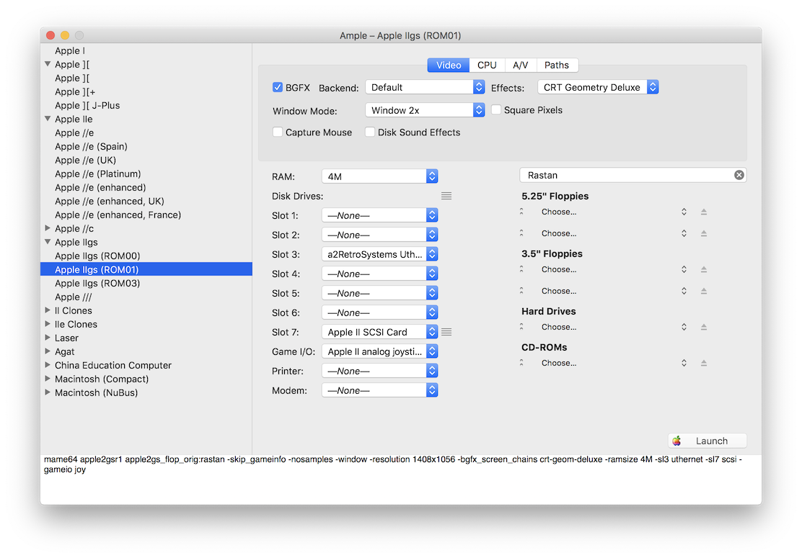

# Ample

A slightly more user-friendly front-end for using MAME as an Apple II emulator. Requires Mac OS X 10.14+

A custom version of MAME is included.  The custom MAME build focuses on Apple II/Macintosh emulators but also includes a handful of other 8/16-bit home computers (BBC, Tandy, etc). There are also a handful of UI tweaks (such as menu items) and, for the Apple II, Uthernet II support.

A note for Macintosh emulation:

* Images selected in the “Hard Drives” section must have a full partition table with Mac drivers (this will always be the case)
* "Hard Disk Images" (enabled with the NuBus Disk Image Pseudo-Card in a slot) can be used to mount standard HFS images without the need of a partition table or driver (this will always be the case)

